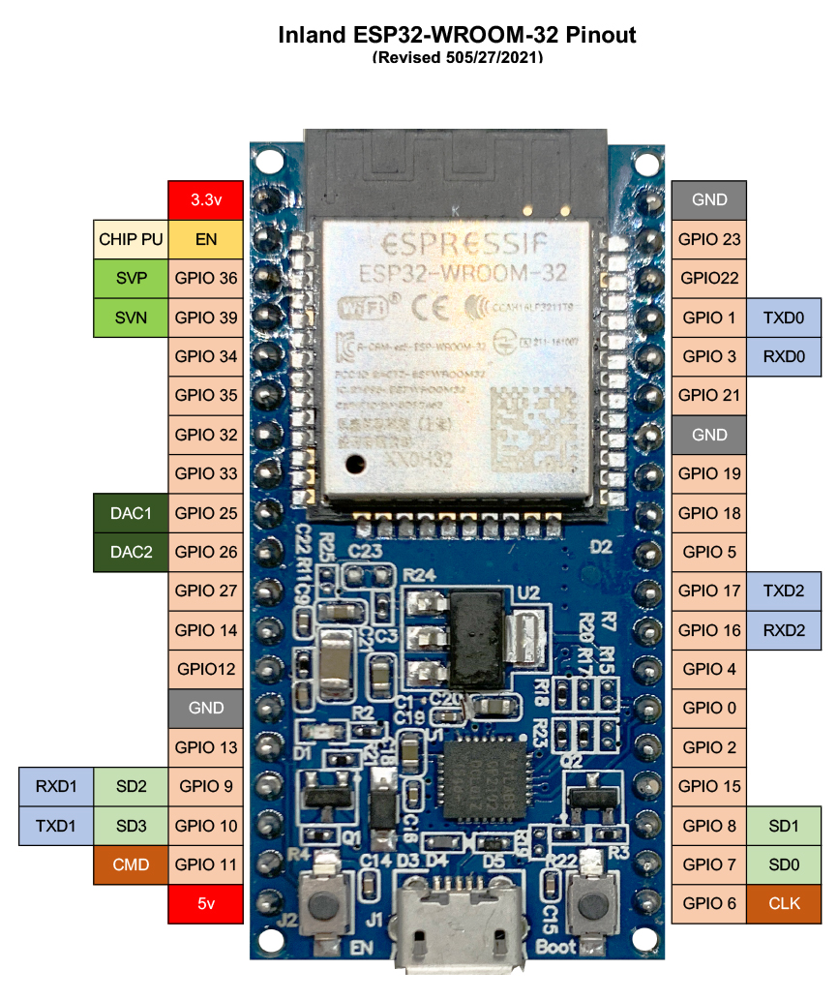

# Inland ESP32-WROOM-32 Pinout
(Revised 505/27/2021)

GitHub user [@natedogg2020](https://github.com/natedogg2020) did an amazing solid for all of us and made a pinout chart of this board. But I wanted to be able to easily compare the pinouts on the Inland version to others when watching how-tos, and pretty much everyone shows their pinouts with the chip at the top and the micro USB at the bottom, so I did a new version showing the board oriented that way to make it a little easier to compare to other boards. 

### Inland ESP32 Dev Board Pinmap PDF
[Get the PDF](docs/INLAND-ESP32-PINOUT-052721.pdf)

### Inland ESP32 Dev Board Pinmap JPG
[Get the JPB](docs/INLAND-ESP32-PINOUT-052721.jpg)

